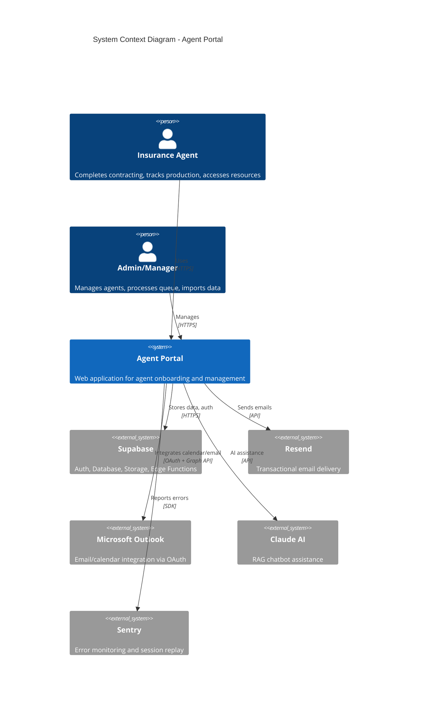
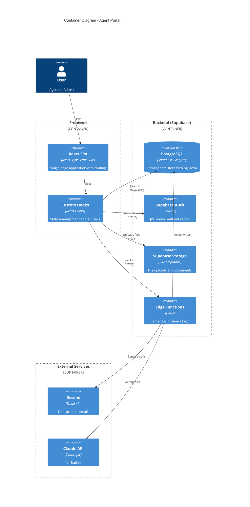

# Architecture Documentation
## TIG Agent Portal

**Version:** 1.0
**Last Updated:** January 25, 2026
**Status:** Production

---

## Table of Contents

1. [System Overview](#1-system-overview)
2. [C4 Model Diagrams](#2-c4-model-diagrams)
3. [Tech Stack](#3-tech-stack)
4. [Frontend Architecture](#4-frontend-architecture)
5. [Backend Architecture](#5-backend-architecture)
6. [Data Architecture](#6-data-architecture)
7. [Security Architecture](#7-security-architecture)
8. [Key Data Flows](#8-key-data-flows)
9. [Architecture Decision Records](#9-architecture-decision-records)
10. [Quality Attributes](#10-quality-attributes)

---

## 1. System Overview

### 1.1 Purpose

The Agent Portal is a full-stack web application for managing insurance agent onboarding, contracting, certifications, and production tracking. It serves as a central hub for agents to complete compliance requirements, access carrier resources, and track their business performance.

### 1.2 Key Capabilities

| Capability | Description |
|------------|-------------|
| **Agent Onboarding** | Multi-step contracting wizard with PDF generation |
| **Certification Management** | RTS import, AHIP tracking, carrier appointments |
| **Book of Business** | Production tracking with milestone achievements |
| **Carrier Resources** | Contacts, portals, plan documents per carrier |
| **Forms Library** | Compliance forms and templates |
| **Training** | Video library with progress tracking |
| **Admin Dashboard** | Agent management, queue processing, reporting |
| **AI Assistant** | RAG-powered chatbot for agent support |

### 1.3 User Personas

```
┌─────────────────┐  ┌─────────────────┐  ┌─────────────────┐  ┌─────────────────┐
│   Super Admin   │  │      Admin      │  │     Manager     │  │      Agent      │
├─────────────────┤  ├─────────────────┤  ├─────────────────┤  ├─────────────────┤
│ • Full access   │  │ • Agent mgmt    │  │ • View downline │  │ • Contracting   │
│ • Create admins │  │ • Queue process │  │ • Roadmap tools │  │ • Resources     │
│ • Activity logs │  │ • RTS import    │  │ • Team reports  │  │ • Production    │
│ • Labs/Features │  │ • Email sending │  │                 │  │ • Training      │
└─────────────────┘  └─────────────────┘  └─────────────────┘  └─────────────────┘
```

---

## 2. C4 Model Diagrams

### 2.1 System Context (Level 1)



### 2.2 Container Diagram (Level 2)



### 2.3 Component Diagram - Frontend (Level 3)

```
┌─────────────────────────────────────────────────────────────────────────────┐
│                              REACT SPA (src/)                                │
├─────────────────────────────────────────────────────────────────────────────┤
│                                                                             │
│  ┌─────────────┐  ┌─────────────┐  ┌─────────────┐  ┌─────────────┐        │
│  │   App.tsx   │  │ProtectedRoute│  │  Contexts   │  │   Hooks     │        │
│  │ (Router)    │──│ (Auth Gate) │──│FeatureFlags │──│ useAuth     │        │
│  └─────────────┘  └─────────────┘  └─────────────┘  │ useProfile  │        │
│                                                      │ useRole     │        │
│  ┌──────────────────────────────────────────────────┴─────────────┘        │
│  │                                                                          │
│  │  PAGES (Route Handlers)                                                  │
│  │  ┌──────────┬──────────┬──────────┬──────────┬──────────┐               │
│  │  │  Index   │Contracting│ Book of │ Carrier  │  Forms   │               │
│  │  │(Dashboard)│  Wizard  │ Business │Resources │ Library  │               │
│  │  └──────────┴──────────┴──────────┴──────────┴──────────┘               │
│  │  ┌──────────┬──────────┬──────────┬──────────┬──────────┐               │
│  │  │ Training │MyProfile │Compliance│ Admin/*  │  Auth/*  │               │
│  │  └──────────┴──────────┴──────────┴──────────┴──────────┘               │
│  │                                                                          │
│  │  COMPONENTS (Feature-Organized)                                          │
│  │  ┌──────────┬──────────┬──────────┬──────────┬──────────┐               │
│  │  │  admin/  │contracting│book-of- │ training/│  layout/ │               │
│  │  │          │ /sections │business/ │          │          │               │
│  │  └──────────┴──────────┴──────────┴──────────┴──────────┘               │
│  │                                                                          │
│  │  UI LIBRARY (Shadcn/Radix)                                               │
│  │  ┌──────────────────────────────────────────────────────┐               │
│  │  │ Button, Dialog, Form, Table, Tabs, Accordion, ...   │               │
│  │  └──────────────────────────────────────────────────────┘               │
│  │                                                                          │
│  └──────────────────────────────────────────────────────────────────────────┘
│                                                                             │
│  ┌─────────────┐  ┌─────────────┐  ┌─────────────┐  ┌─────────────┐        │
│  │    lib/     │  │   utils/    │  │   types/    │  │integrations/│        │
│  │ sync.ts     │  │activityLog  │  │contracting  │  │  supabase/  │        │
│  │ rtsImport   │  │             │  │             │  │  client.ts  │        │
│  └─────────────┘  └─────────────┘  └─────────────┘  └─────────────┘        │
└─────────────────────────────────────────────────────────────────────────────┘
```

### 2.4 Component Diagram - Backend (Level 3)

```
┌─────────────────────────────────────────────────────────────────────────────┐
│                         SUPABASE EDGE FUNCTIONS                              │
├─────────────────────────────────────────────────────────────────────────────┤
│                                                                             │
│  SHARED UTILITIES (_shared/)                                                │
│  ┌─────────────────────────────────────────────────────────────────────┐   │
│  │  auth.ts (JWT validation, role checking)                            │   │
│  │  cors.ts (CORS headers for allowed origins)                         │   │
│  └─────────────────────────────────────────────────────────────────────┘   │
│                                                                             │
│  AGENT LIFECYCLE                          ADMIN OPERATIONS                  │
│  ┌────────────────────┐                   ┌────────────────────┐           │
│  │ create-agent       │                   │ create-admin       │           │
│  │ send-setup-link    │                   │ delete-user        │           │
│  │ validate-password  │                   │ reset-user-password│           │
│  └────────────────────┘                   │ reset-contracting  │           │
│                                           └────────────────────┘           │
│  PDF GENERATION                           EMAIL                             │
│  ┌────────────────────┐                   ┌────────────────────┐           │
│  │ generate-contract  │                   │ send-contracting   │           │
│  │   -ing-pdf         │                   │   -packet          │           │
│  │ generate-growth    │                   │ send-agent-inquiry │           │
│  │   -plan-pdf        │                   │ microsoft-send     │           │
│  │ extract-pdf-fields │                   │   -email           │           │
│  └────────────────────┘                   └────────────────────┘           │
│                                                                             │
│  AI / RAG                                 INTEGRATIONS                      │
│  ┌────────────────────┐                   ┌────────────────────┐           │
│  │ agent-chat         │                   │ microsoft-oauth    │           │
│  │ agent-chat-rag     │                   │   -start           │           │
│  │ process-document   │                   │ microsoft-oauth    │           │
│  └────────────────────┘                   │   -callback        │           │
│                                           │ parse-production   │           │
│  UTILITY                                  │   -report          │           │
│  ┌────────────────────┐                   └────────────────────┘           │
│  │ fetch-edge-logs    │                                                    │
│  │ pdf-field-audit    │                                                    │
│  └────────────────────┘                                                    │
│                                                                             │
└─────────────────────────────────────────────────────────────────────────────┘
```

---

## 3. Tech Stack

### 3.1 Frontend

| Layer | Technology | Version | Purpose |
|-------|------------|---------|---------|
| **Framework** | React | 18.3 | UI library |
| **Language** | TypeScript | 5.8 | Type safety |
| **Build** | Vite | 5.4 | Development server & bundler |
| **Routing** | React Router | 6.30 | Client-side navigation |
| **Styling** | TailwindCSS | 3.4 | Utility-first CSS |
| **Components** | Shadcn/ui + Radix | Latest | Accessible component library |
| **Forms** | React Hook Form + Zod | 7.61 / 3.25 | Form state + validation |
| **Server State** | TanStack Query | 5.83 | Data fetching & caching |
| **Charts** | Recharts | 2.15 | Data visualization |
| **Icons** | Lucide React | 0.462 | Icon library |
| **Notifications** | Sonner | 1.7 | Toast messages |
| **PDF** | jsPDF + pdfjs-dist | 3.0 / 5.4 | PDF generation & viewing |
| **Excel** | XLSX | 0.18 | Excel file parsing |
| **Monitoring** | Sentry | 10.34 | Error tracking & replay |

### 3.2 Backend

| Layer | Technology | Version | Purpose |
|-------|------------|---------|---------|
| **Platform** | Supabase | Latest | Backend-as-a-Service |
| **Database** | PostgreSQL | 17.6 | Primary data store |
| **Vector DB** | pgvector | - | AI embeddings (1536 dimensions) |
| **Auth** | Supabase Auth | - | JWT authentication |
| **Storage** | Supabase Storage | - | File uploads |
| **Functions** | Deno Edge Functions | - | Serverless compute |
| **Email** | Resend | - | Transactional email |
| **AI** | Claude (Anthropic) | - | Chatbot & RAG |

### 3.3 Infrastructure

| Component | Provider | Purpose |
|-----------|----------|---------|
| **Hosting** | Vercel | Frontend deployment |
| **Database** | Supabase Cloud | Managed PostgreSQL |
| **Functions** | Supabase Edge | Deno runtime |
| **CDN** | Vercel Edge | Static asset delivery |
| **DNS** | Custom domain | tigagenthub.com |

---

## 4. Frontend Architecture

### 4.1 Directory Structure

```
src/
├── main.tsx                 # App entry point
├── App.tsx                  # Root router with error boundary
├── index.css                # Global styles + Tailwind
│
├── pages/                   # Route page components
│   ├── Index.tsx           # Dashboard
│   ├── ContractingPage.tsx # Multi-step wizard
│   ├── BookOfBusinessPage.tsx
│   ├── auth/               # Auth pages
│   │   ├── AuthPage.tsx
│   │   ├── SetPasswordPage.tsx
│   │   └── ForgotPasswordPage.tsx
│   └── admin/              # Admin pages
│       ├── AdminDashboard.tsx
│       ├── AgentsPage.tsx
│       └── ...
│
├── components/              # Reusable components
│   ├── ui/                 # Shadcn component library
│   ├── admin/              # Admin-specific
│   ├── contracting/        # Contracting wizard
│   │   └── sections/       # Form sections
│   ├── book-of-business/   # Production tracking
│   ├── training/           # Video library
│   ├── layout/             # Page layouts
│   ├── Navigation.tsx
│   ├── ProtectedRoute.tsx
│   └── UserAvatarDropdown.tsx
│
├── hooks/                   # Custom React hooks
│   ├── useAuth.ts          # Combined auth state
│   ├── useProfile.ts       # Profile + session
│   ├── useRole.ts          # Role-based permissions
│   ├── useContractingApplication.ts
│   ├── useContractingPdf.ts
│   └── ...
│
├── contexts/                # React Context providers
│   └── FeatureFlagsContext.tsx
│
├── lib/                     # Business logic
│   ├── sync.ts             # Book of Business sync
│   ├── rtsImport.ts        # RTS Excel import
│   └── formatters.ts
│
├── utils/                   # Utilities
│   └── activityLogger.ts   # Audit logging
│
├── types/                   # TypeScript definitions
│   └── contracting.ts
│
├── integrations/            # External service clients
│   └── supabase/
│       ├── client.ts       # SDK initialization
│       └── types.ts        # Auto-generated DB types
│
├── data/                    # Static data/constants
│   └── carriersData.ts
│
└── assets/                  # Images, logos
```

### 4.2 Routing Architecture

```typescript
// App.tsx - Route Configuration
<Routes>
  {/* Public */}
  <Route path="/auth" element={<AuthPage />} />
  <Route path="/auth/set-password" element={<SetPasswordPage />} />
  <Route path="/auth/forgot-password" element={<ForgotPasswordPage />} />

  {/* Protected - Agents */}
  <Route path="/" element={<ProtectedRoute><Index /></ProtectedRoute>} />
  <Route path="/contracting" element={<ProtectedRoute allowContractingOnly><ContractingPage /></ProtectedRoute>} />
  <Route path="/book-of-business" element={<ProtectedRoute><BookOfBusinessPage /></ProtectedRoute>} />
  {/* ... more agent routes */}

  {/* Protected - Admin */}
  <Route path="/admin" element={<ProtectedRoute requireAdmin><AdminDashboard /></ProtectedRoute>} />
  <Route path="/admin/agents" element={<ProtectedRoute requireAdmin><AgentsPage /></ProtectedRoute>} />
  <Route path="/admin/activity-log" element={<ProtectedRoute requireSuperAdmin><ActivityLogPage /></ProtectedRoute>} />
  {/* ... more admin routes */}
</Routes>
```

### 4.3 State Management Pattern

The application uses **hook composition** instead of Redux/Zustand:

```typescript
// useAuth.ts - Composite hook
export function useAuth() {
  const { user, profile, loading: profileLoading, onboardingStatus, isActive } = useProfile();
  const { roles, primaryRole, ...roleUtils } = useRole();

  return {
    // Auth state
    user,
    profile,
    isAuthenticated: !!user,
    loading: profileLoading,

    // Profile state
    onboardingStatus,
    isActive,

    // Role state
    roles,
    primaryRole,

    // Permission methods
    isAdmin: () => roleUtils.isAdmin(),
    isSuperAdmin: () => roleUtils.isSuperAdmin(),
    canAccessAdmin: () => roleUtils.canAccessAdmin(),
    hasDownline: () => roleUtils.hasDownline(),
  };
}
```

### 4.4 Form State Management

Multi-step forms use debounced auto-save:

```typescript
// useContractingApplication.ts
const DEBOUNCE_MS = 800;

function useContractingApplication() {
  const [application, setApplication] = useState<ContractingApplication | null>(null);
  const pendingUpdatesRef = useRef<Partial<ContractingApplication>>({});
  const debounceRef = useRef<NodeJS.Timeout>();

  const updateField = useCallback((field: string, value: any) => {
    // Optimistic update
    setApplication(prev => ({ ...prev!, [field]: value }));

    // Queue for DB write
    pendingUpdatesRef.current[field] = value;

    // Debounce
    clearTimeout(debounceRef.current);
    debounceRef.current = setTimeout(() => flushUpdates(), DEBOUNCE_MS);
  }, []);

  return { application, updateField, ... };
}
```

---

## 5. Backend Architecture

### 5.1 Edge Functions

| Function | Auth | Purpose |
|----------|------|---------|
| `create-agent` | Admin | Create agent account + send setup email |
| `create-admin` | Super Admin | Create admin account |
| `send-setup-link` | Admin | Resend password setup email |
| `delete-user` | Super Admin | Delete user account |
| `reset-user-password` | Super Admin | Reset user password |
| `generate-contracting-pdf` | Authenticated | Generate contracting packet PDF |
| `send-contracting-packet` | Authenticated | Email contracting packet |
| `agent-chat` | Authenticated | AI chatbot |
| `agent-chat-rag` | Authenticated | RAG-powered AI chatbot |
| `process-document` | Admin | Process document for RAG |
| `microsoft-oauth-start` | Public | Start OAuth flow |
| `microsoft-oauth-callback` | Public | OAuth callback handler |
| `microsoft-send-email` | Authenticated | Send email via Outlook |
| `parse-production-report` | Admin | Parse RTS Excel file |
| `send-agent-inquiry` | Public | Contact form submission |

### 5.2 Authentication Flow

```
┌─────────┐     ┌─────────────┐     ┌──────────────┐     ┌──────────┐
│ Browser │────▶│ Supabase    │────▶│ Edge Function│────▶│ Database │
│         │     │ Auth (JWT)  │     │ (validates)  │     │          │
└─────────┘     └─────────────┘     └──────────────┘     └──────────┘
     │                                     │
     │  1. Login with email/password       │
     │◀────────────────────────────────────│
     │  2. Receive JWT + refresh token     │
     │                                     │
     │  3. API call with Authorization     │
     │────────────────────────────────────▶│
     │  4. Function validates JWT          │
     │  5. Checks user_roles table         │
     │  6. Returns data if authorized      │
     │◀────────────────────────────────────│
```

### 5.3 Edge Function Pattern

```typescript
// Standard edge function structure
import { createClient } from "https://esm.sh/@supabase/supabase-js@2";
import { corsHeaders } from "../_shared/cors.ts";

Deno.serve(async (req) => {
  // CORS preflight
  if (req.method === "OPTIONS") {
    return new Response(null, { headers: corsHeaders });
  }

  try {
    // 1. Extract auth token
    const authHeader = req.headers.get("Authorization");
    if (!authHeader) throw new Error("No authorization header");

    // 2. Create Supabase client
    const supabase = createClient(
      Deno.env.get("SUPABASE_URL")!,
      Deno.env.get("SUPABASE_SERVICE_ROLE_KEY")!
    );

    // 3. Validate user
    const { data: { user }, error } = await supabase.auth.getUser(
      authHeader.replace("Bearer ", "")
    );
    if (error || !user) throw new Error("Invalid token");

    // 4. Check roles if needed
    const { data: roles } = await supabase
      .from("user_roles")
      .select("role")
      .eq("user_id", user.id);

    // 5. Business logic...

    return new Response(JSON.stringify({ success: true }), {
      headers: { ...corsHeaders, "Content-Type": "application/json" }
    });

  } catch (error) {
    return new Response(JSON.stringify({ error: error.message }), {
      status: 400,
      headers: { ...corsHeaders, "Content-Type": "application/json" }
    });
  }
});
```

---

## 6. Data Architecture

### 6.1 Entity Relationship Diagram

```
┌──────────────────────────────────────────────────────────────────────────────┐
│                              CORE ENTITIES                                    │
├──────────────────────────────────────────────────────────────────────────────┤
│                                                                              │
│  ┌─────────────┐         ┌─────────────┐         ┌─────────────┐            │
│  │ auth.users  │────────▶│  profiles   │────────▶│ user_roles  │            │
│  │ (Supabase)  │  1:1    │             │  1:N    │             │            │
│  └─────────────┘         └──────┬──────┘         └─────────────┘            │
│                                 │                                            │
│         ┌───────────────────────┼───────────────────────┐                   │
│         │                       │                       │                   │
│         ▼                       ▼                       ▼                   │
│  ┌─────────────┐         ┌─────────────┐         ┌─────────────┐            │
│  │contracting_ │         │carrier_     │         │agent_       │            │
│  │applications │         │statuses     │         │certifications│           │
│  │ (JSON blob) │         │             │         │             │            │
│  └─────────────┘         └─────────────┘         └─────────────┘            │
│                                 │                                            │
│                                 ▼                                            │
│                          ┌─────────────┐                                    │
│                          │  carriers   │                                    │
│                          │             │                                    │
│                          └─────────────┘                                    │
│                                                                              │
└──────────────────────────────────────────────────────────────────────────────┘

┌──────────────────────────────────────────────────────────────────────────────┐
│                           PRODUCTION TRACKING                                 │
├──────────────────────────────────────────────────────────────────────────────┤
│                                                                              │
│  profiles ◀────┐                                                            │
│                │                                                            │
│         ┌──────┴──────┐         ┌─────────────┐         ┌─────────────┐     │
│         │monthly_syncs│────────▶│sync_carrier_│         │ milestones  │     │
│         │             │  1:N    │uploads      │         │             │     │
│         └─────────────┘         └─────────────┘         └─────────────┘     │
│                │                       │                       ▲            │
│                │                       ▼                       │            │
│                │                ┌─────────────┐                │            │
│                │                │agent_carriers│               │            │
│                │                │ (selected)  │────────────────┘            │
│                │                └─────────────┘                             │
│                │                                                            │
│                ▼                                                            │
│         ┌─────────────┐                                                     │
│         │  policies   │                                                     │
│         │ (clients)   │                                                     │
│         └─────────────┘                                                     │
│                                                                              │
└──────────────────────────────────────────────────────────────────────────────┘

┌──────────────────────────────────────────────────────────────────────────────┐
│                           CARRIER RESOURCES                                   │
├──────────────────────────────────────────────────────────────────────────────┤
│                                                                              │
│         ┌─────────────┐                                                     │
│         │  carriers   │                                                     │
│         └──────┬──────┘                                                     │
│                │                                                            │
│    ┌───────────┼───────────┬───────────────┐                               │
│    ▼           ▼           ▼               ▼                               │
│ ┌────────┐ ┌────────┐ ┌────────┐    ┌────────────┐                         │
│ │contacts│ │ links  │ │documents│   │carrier_    │                         │
│ │        │ │        │ │        │    │directory_* │                         │
│ └────────┘ └────────┘ └────────┘    └────────────┘                         │
│                                                                              │
└──────────────────────────────────────────────────────────────────────────────┘
```

### 6.2 Key Tables

| Table | Purpose | Key Fields |
|-------|---------|------------|
| `profiles` | User profiles | `user_id`, `full_name`, `email`, `npn`, `manager_id`, `onboarding_status` |
| `user_roles` | Role assignments | `user_id`, `role` (super_admin, admin, manager, agent) |
| `contracting_applications` | Contracting wizard data | `profile_id`, JSON fields for form sections |
| `carriers` | Carrier definitions | `code`, `name`, `display_name`, `rts_aliases` |
| `carrier_statuses` | Agent-carrier relationship | `profile_id`, `carrier_id`, `status`, `contract_year` |
| `agent_certifications` | RTS certifications | `profile_id`, `carrier_name`, `certification_year` |
| `monthly_syncs` | Production sync records | `profile_id`, `month`, `year`, `total_clients` |
| `sync_carrier_uploads` | Per-carrier uploads | `sync_id`, `carrier_code`, `client_count` |
| `milestones` | Achievement records | `profile_id`, `threshold`, `achieved_at` |
| `activity_logs` | Audit trail | `user_id`, `action_type`, `entity_type`, `metadata` |
| `document_chunks` | RAG vector embeddings | `content`, `embedding`, `metadata` |

### 6.3 Onboarding Status Flow

```
CONTRACTING_REQUIRED ──▶ CONTRACTING_SUBMITTED ──▶ APPOINTED
         │                        │                    │
         │                        │                    │
         ▼                        ▼                    ▼
    Forces /contracting      Admin reviews      Full platform
       route only             in queue            access
                                  │
                                  ▼
                              SUSPENDED
                                  │
                                  ▼
                           Auto logout on
                             next load
```

---

## 7. Security Architecture

### 7.1 Authentication

| Layer | Implementation |
|-------|----------------|
| **Identity Provider** | Supabase Auth (GoTrue) |
| **Credential Storage** | Supabase managed (bcrypt hashed) |
| **Session Management** | JWT tokens with refresh |
| **Token Storage** | Browser localStorage (Supabase SDK) |
| **Token Refresh** | Automatic via Supabase client |

### 7.2 Authorization Layers

```
┌─────────────────────────────────────────────────────────────────┐
│                    AUTHORIZATION LAYERS                          │
├─────────────────────────────────────────────────────────────────┤
│                                                                 │
│  Layer 1: ROUTE PROTECTION (ProtectedRoute component)          │
│  ┌─────────────────────────────────────────────────────────┐   │
│  │ • requireAdmin: Admin or Super Admin only               │   │
│  │ • requireSuperAdmin: Super Admin only                   │   │
│  │ • requireAgent: Any authenticated agent                 │   │
│  │ • allowContractingOnly: Agents in CONTRACTING_REQUIRED  │   │
│  └─────────────────────────────────────────────────────────┘   │
│                                                                 │
│  Layer 2: ROLE-BASED ACCESS CONTROL (user_roles table)         │
│  ┌─────────────────────────────────────────────────────────┐   │
│  │ Roles: super_admin > admin > manager > agent            │   │
│  │ Checked via useRole() hook                              │   │
│  └─────────────────────────────────────────────────────────┘   │
│                                                                 │
│  Layer 3: ONBOARDING STATUS GATES (profiles.onboarding_status) │
│  ┌─────────────────────────────────────────────────────────┐   │
│  │ CONTRACTING_REQUIRED → Limited to /contracting          │   │
│  │ SUSPENDED → Auto logout, access denied                  │   │
│  └─────────────────────────────────────────────────────────┘   │
│                                                                 │
│  Layer 4: EDGE FUNCTION VALIDATION                             │
│  ┌─────────────────────────────────────────────────────────┐   │
│  │ • JWT validation via supabase.auth.getUser()            │   │
│  │ • Role checking via user_roles query                    │   │
│  │ • Service role key for privileged operations            │   │
│  └─────────────────────────────────────────────────────────┘   │
│                                                                 │
└─────────────────────────────────────────────────────────────────┘
```

### 7.3 Password Policy

| Requirement | Value |
|-------------|-------|
| Minimum length | 12 characters |
| Uppercase | At least 1 |
| Lowercase | At least 1 |
| Number | At least 1 |
| Special character | At least 1 |
| Validation | Client + server side |

### 7.4 Data Protection

| Measure | Implementation |
|---------|----------------|
| **Transport** | HTTPS only |
| **API Keys** | Environment variables, never in code |
| **File Uploads** | Supabase Storage with auth |
| **PII** | Stored in Supabase (SOC2 compliant) |
| **Audit Trail** | activity_logs table |

---

## 8. Key Data Flows

### 8.1 Agent Onboarding Flow

```
┌──────────────────────────────────────────────────────────────────────────────┐
│                         AGENT ONBOARDING FLOW                                 │
├──────────────────────────────────────────────────────────────────────────────┤
│                                                                              │
│  1. ADMIN CREATES AGENT                                                      │
│     Admin Dashboard → "Start Agent Contracting"                              │
│     │                                                                        │
│     ▼                                                                        │
│  ┌─────────────────────────────────────────────────────────────────────┐    │
│  │ create-agent edge function:                                          │    │
│  │ • Create Supabase auth user (temp password)                         │    │
│  │ • Insert profile (onboarding_status: CONTRACTING_REQUIRED)          │    │
│  │ • Assign 'independent_agent' role                                   │    │
│  │ • Generate password recovery link                                   │    │
│  │ • Send welcome email via Resend                                     │    │
│  └─────────────────────────────────────────────────────────────────────┘    │
│     │                                                                        │
│     ▼                                                                        │
│  2. AGENT RECEIVES EMAIL                                                     │
│     "Welcome to [Platform]" → Click "Activate Your Account"                  │
│     │                                                                        │
│     ▼                                                                        │
│  3. AGENT SETS PASSWORD                                                      │
│     /auth/set-password → Password form with strength indicator               │
│     │                                                                        │
│     ▼                                                                        │
│  4. AUTO-REDIRECT TO CONTRACTING                                             │
│     /contracting → Multi-step wizard (8 sections)                            │
│     │                                                                        │
│     │  ┌─────────────────────────────────────────────────────────────┐      │
│     │  │ Wizard Sections:                                            │      │
│     │  │ 1. Welcome / Carrier Intro                                  │      │
│     │  │ 2. Personal & Contact Info                                  │      │
│     │  │ 3. Licensing & ID                                           │      │
│     │  │ 4. Legal Questions                                          │      │
│     │  │ 5. Banking & Direct Deposit                                 │      │
│     │  │ 6. Training & Certificates                                  │      │
│     │  │ 7. Agreements & Signature                                   │      │
│     │  │ 8. Review & Submit                                          │      │
│     │  │                                                             │      │
│     │  │ Auto-save: Debounced 800ms to contracting_applications      │      │
│     │  └─────────────────────────────────────────────────────────────┘      │
│     │                                                                        │
│     ▼                                                                        │
│  5. SUBMIT CONTRACTING                                                       │
│     │                                                                        │
│     ▼                                                                        │
│  ┌─────────────────────────────────────────────────────────────────────┐    │
│  │ generate-contracting-pdf + send-contracting-packet:                 │    │
│  │ • Generate multi-page PDF with form field mapping                   │    │
│  │ • Upload PDF to Supabase Storage                                    │    │
│  │ • Email packet to admin (caroline@...)                              │    │
│  │ • Email confirmation to agent                                       │    │
│  │ • Update status: CONTRACTING_SUBMITTED                              │    │
│  └─────────────────────────────────────────────────────────────────────┘    │
│     │                                                                        │
│     ▼                                                                        │
│  6. ADMIN REVIEWS                                                            │
│     Admin Dashboard → Contracting Queue                                      │
│     │                                                                        │
│     ▼                                                                        │
│  7. ADMIN APPROVES                                                           │
│     Update status: APPOINTED → Agent has full access                         │
│                                                                              │
└──────────────────────────────────────────────────────────────────────────────┘
```

### 8.2 Book of Business Sync Flow

```
┌──────────────────────────────────────────────────────────────────────────────┐
│                      BOOK OF BUSINESS SYNC FLOW                               │
├──────────────────────────────────────────────────────────────────────────────┤
│                                                                              │
│  1. CHECK SYNC STATUS                                                        │
│     checkSyncStatus()                                                        │
│     │                                                                        │
│     ├─ Has contracted carriers? ─────────── No ──▶ "Set up carriers"        │
│     │                                                                        │
│     ├─ Selected carriers to track? ──────── No ──▶ "Select carriers"        │
│     │                                                                        │
│     └─ Past 5th of month? ───────────────── No ──▶ "Sync not due yet"       │
│                │                                                             │
│                ▼ Yes to all                                                  │
│                                                                              │
│  2. INITIALIZE SYNC                                                          │
│     initializeSync()                                                         │
│     │                                                                        │
│     ▼                                                                        │
│  ┌─────────────────────────────────────────────────────────────────────┐    │
│  │ • Create monthly_syncs record (month, year, status: 'in_progress')  │    │
│  │ • Calculate previous_month_total from prior sync                    │    │
│  │ • Create sync_carrier_uploads for each selected carrier             │    │
│  │ • Return sync ID + carrier upload records                           │    │
│  └─────────────────────────────────────────────────────────────────────┘    │
│     │                                                                        │
│     ▼                                                                        │
│  3. AGENT UPLOADS PER CARRIER                                                │
│     For each carrier in agent_carriers:                                      │
│     │                                                                        │
│     ▼                                                                        │
│  ┌─────────────────────────────────────────────────────────────────────┐    │
│  │ updateCarrierUpload(syncId, carrierCode, clientCount)               │    │
│  │ • Update sync_carrier_uploads.client_count                          │    │
│  │ • Set completed_at timestamp                                        │    │
│  └─────────────────────────────────────────────────────────────────────┘    │
│     │                                                                        │
│     ▼                                                                        │
│  4. COMPLETE SYNC                                                            │
│     completeSync()                                                           │
│     │                                                                        │
│     ▼                                                                        │
│  ┌─────────────────────────────────────────────────────────────────────┐    │
│  │ • Sum all carrier uploads → total_clients                           │    │
│  │ • Calculate delta from previous month                               │    │
│  │ • Check milestone thresholds (100, 250, 500, 1000, 2500)           │    │
│  │ • Insert new milestone records if achieved                          │    │
│  │ • Update monthly_syncs status: 'completed'                          │    │
│  └─────────────────────────────────────────────────────────────────────┘    │
│     │                                                                        │
│     ▼                                                                        │
│  5. MILESTONE REVEAL (if new milestone)                                      │
│     MilestoneReveal component → Confetti animation                           │
│                                                                              │
└──────────────────────────────────────────────────────────────────────────────┘
```

### 8.3 RTS Import Flow

```
┌──────────────────────────────────────────────────────────────────────────────┐
│                           RTS IMPORT FLOW                                     │
├──────────────────────────────────────────────────────────────────────────────┤
│                                                                              │
│  Admin uploads Excel file → RTSImportPage.tsx                                │
│     │                                                                        │
│     ▼                                                                        │
│  importRTSCertifications(file)                                               │
│     │                                                                        │
│     ▼                                                                        │
│  ┌─────────────────────────────────────────────────────────────────────┐    │
│  │ PHASE 1: Parse Excel headers                                        │    │
│  │ • Identify certification columns (carrier names)                    │    │
│  │ • Extract year from column headers                                  │    │
│  └─────────────────────────────────────────────────────────────────────┘    │
│     │                                                                        │
│     ▼                                                                        │
│  ┌─────────────────────────────────────────────────────────────────────┐    │
│  │ PHASE 2: Build NPN → Profile map                                    │    │
│  │ • Query profiles with NPNs                                          │    │
│  │ • Create lookup map for matching                                    │    │
│  └─────────────────────────────────────────────────────────────────────┘    │
│     │                                                                        │
│     ▼                                                                        │
│  ┌─────────────────────────────────────────────────────────────────────┐    │
│  │ PHASE 3: Identify unmatched NPNs                                    │    │
│  │ • Find NPNs in RTS data not in profiles                            │    │
│  └─────────────────────────────────────────────────────────────────────┘    │
│     │                                                                        │
│     ▼                                                                        │
│  ┌─────────────────────────────────────────────────────────────────────┐    │
│  │ PHASE 4: Create stub profiles for unmatched                         │    │
│  │ • Insert profile with NPN, name from RTS                           │    │
│  │ • No user_id (not invited yet)                                     │    │
│  └─────────────────────────────────────────────────────────────────────┘    │
│     │                                                                        │
│     ▼                                                                        │
│  ┌─────────────────────────────────────────────────────────────────────┐    │
│  │ PHASE 5: Upsert agent_certifications                                │    │
│  │ • For each agent row, for each carrier column                      │    │
│  │ • If certified (Y/Certified), upsert record                        │    │
│  │ • Batch in groups of 500                                           │    │
│  └─────────────────────────────────────────────────────────────────────┘    │
│     │                                                                        │
│     ▼                                                                        │
│  ┌─────────────────────────────────────────────────────────────────────┐    │
│  │ PHASE 6: Upsert carrier_statuses                                    │    │
│  │ • For current year certifications                                  │    │
│  │ • Set status = 'contracted'                                        │    │
│  └─────────────────────────────────────────────────────────────────────┘    │
│     │                                                                        │
│     ▼                                                                        │
│  ┌─────────────────────────────────────────────────────────────────────┐    │
│  │ PHASE 7: Log import results                                         │    │
│  │ • Insert rts_import_logs record                                    │    │
│  │ • Display results in UI                                            │    │
│  └─────────────────────────────────────────────────────────────────────┘    │
│     │                                                                        │
│     ▼                                                                        │
│  Results: { matched, created, imported, updated, errors }                    │
│                                                                              │
└──────────────────────────────────────────────────────────────────────────────┘
```

---

## 9. Architecture Decision Records

### ADR-001: React Hook Composition over Redux

**Status:** Accepted
**Date:** December 2025

**Context:**
Needed state management for auth, profile, roles, and form state.

**Decision:**
Use custom React hooks with composition (useAuth combines useProfile + useRole) instead of Redux/Zustand.

**Rationale:**
- Single user per session (no complex shared state)
- Hooks are more idiomatic to React
- Simpler mental model and debugging
- Less boilerplate than Redux

**Consequences:**
- Positive: Cleaner code, easier testing, smaller bundle
- Negative: May need refactor if multi-user collaboration added

---

### ADR-002: Debounced Auto-Save for Forms

**Status:** Accepted
**Date:** December 2025

**Context:**
Multi-step contracting wizard with many fields needs data persistence without excessive API calls.

**Decision:**
Implement 800ms debounced auto-save with optimistic updates.

**Rationale:**
- Prevents data loss on accidental navigation
- Reduces server load vs save-on-every-keystroke
- Provides responsive UI with optimistic updates

**Consequences:**
- Positive: Reliable data persistence, good UX
- Negative: Slight complexity in managing pending updates queue

---

### ADR-003: Edge Functions with Internal JWT Validation

**Status:** Accepted
**Date:** December 2025

**Context:**
Supabase JWT verification at gateway level had ECC key compatibility issues.

**Decision:**
Disable gateway JWT verification; validate tokens inside edge functions using `supabase.auth.getUser()`.

**Rationale:**
- Works around key format issues
- Still provides secure authentication
- Allows function-level auth customization

**Consequences:**
- Positive: Reliable auth, function-level control
- Negative: Slightly more code per function, small performance overhead

---

### ADR-004: JSONB for Nested Form Data

**Status:** Accepted
**Date:** December 2025

**Context:**
Contracting form has deeply nested data (addresses, agreements, legal questions).

**Decision:**
Store complex nested structures as JSONB columns in PostgreSQL.

**Rationale:**
- Flexible schema for evolving form structure
- Single-row updates for complex objects
- PostgreSQL JSONB is well-optimized

**Consequences:**
- Positive: Schema flexibility, simpler queries
- Negative: Harder to query individual nested fields, no FK constraints on nested data

---

### ADR-005: pgvector for RAG Embeddings

**Status:** Accepted
**Date:** January 2026

**Context:**
Need vector similarity search for AI chatbot (RAG).

**Decision:**
Use pgvector extension with 1536-dimension embeddings.

**Rationale:**
- Native PostgreSQL extension (no separate vector DB)
- Integrates with existing Supabase infrastructure
- Supports cosine similarity for semantic search

**Consequences:**
- Positive: Single database, simpler infrastructure
- Negative: May need scaling considerations for large embedding volumes

---

### ADR-006: Feature Flags via Database

**Status:** Accepted
**Date:** January 2026

**Context:**
Need ability to toggle features without redeployment.

**Decision:**
Implement feature_flags table with React Context provider.

**Rationale:**
- Runtime feature toggles
- Supports gradual rollout
- Admin-controllable via database

**Consequences:**
- Positive: Flexible feature management
- Negative: Additional database query on app load

---

## 10. Quality Attributes

### 10.1 Performance

| Metric | Target | Implementation |
|--------|--------|----------------|
| **Initial Load** | < 3s | Vite code splitting, lazy routes |
| **API Response** | < 500ms | Edge functions, indexed queries |
| **Form Save** | < 200ms perceived | Optimistic updates |
| **Build Size** | < 3MB | Tree shaking, dynamic imports |

### 10.2 Reliability

| Measure | Implementation |
|---------|----------------|
| **Error Monitoring** | Sentry with session replay |
| **Data Persistence** | Debounced auto-save |
| **Auth Resilience** | Auto token refresh |
| **Graceful Degradation** | Feature flags for unstable features |

### 10.3 Maintainability

| Practice | Implementation |
|----------|----------------|
| **Type Safety** | TypeScript end-to-end |
| **Code Organization** | Feature-based directory structure |
| **Documentation** | JSDoc comments, architecture docs |
| **Linting** | ESLint + TypeScript ESLint |

### 10.4 Scalability

| Concern | Approach |
|---------|----------|
| **Database** | Supabase managed PostgreSQL (auto-scaling) |
| **Functions** | Deno edge functions (distributed) |
| **Batch Processing** | Process in batches of 500 |
| **Caching** | TanStack Query with stale-while-revalidate |

---

## Appendix A: File Reference

### Key Configuration Files

| File | Purpose |
|------|---------|
| `package.json` | Dependencies and scripts |
| `vite.config.ts` | Build configuration |
| `tailwind.config.ts` | Styling configuration |
| `tsconfig.json` | TypeScript configuration |
| `supabase/config.toml` | Edge function configuration |

### Key Source Files

| File | Purpose |
|------|---------|
| `src/App.tsx` | Root router and error boundary |
| `src/hooks/useAuth.ts` | Combined auth state |
| `src/hooks/useContractingApplication.ts` | Form state with auto-save |
| `src/lib/sync.ts` | Book of Business logic |
| `src/lib/rtsImport.ts` | RTS import pipeline |
| `supabase/functions/create-agent/index.ts` | Agent creation |
| `supabase/functions/generate-contracting-pdf/index.ts` | PDF generation |

### Database Migrations

Located in `supabase/migrations/` - 67 migration files covering:
- Core tables (profiles, user_roles, carriers)
- Contracting (contracting_applications, carrier_statuses)
- Production tracking (monthly_syncs, milestones)
- Carrier resources (carrier_directory_*, forms)
- AI/RAG (document_chunks, processing_jobs)
- Audit (activity_logs, rts_import_logs)

---

## Appendix B: Glossary

| Term | Definition |
|------|------------|
| **NPN** | National Producer Number (unique agent identifier) |
| **RTS** | Ready to Sell (certification status) |
| **AHIP** | America's Health Insurance Plans (certification body) |
| **Contracting** | Process of setting up agent with carriers |
| **Book of Business** | Agent's portfolio of clients |
| **RAG** | Retrieval Augmented Generation (AI technique) |
| **Edge Function** | Serverless function running at edge locations |
